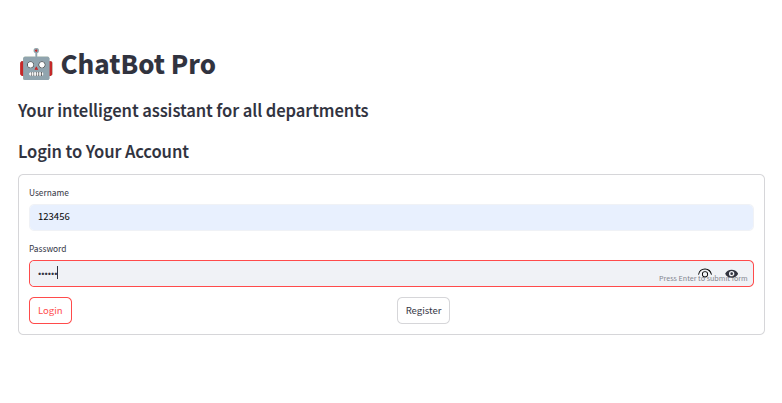
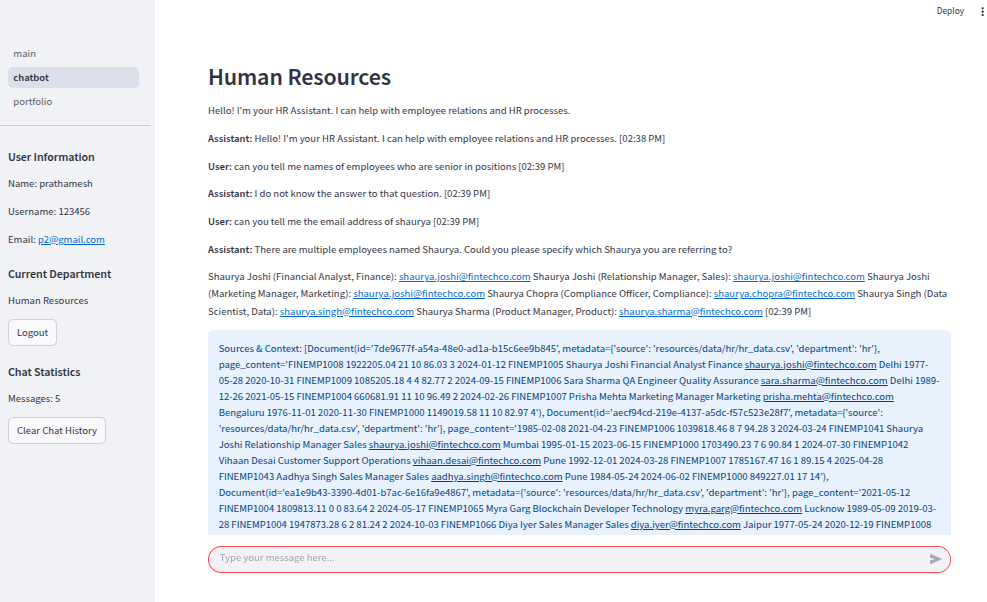
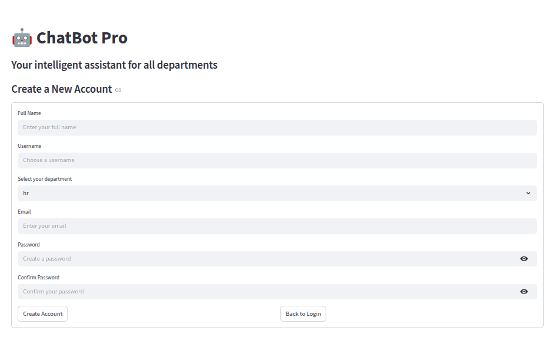

# 🤖 ChatBot Pro

Welcome to **ChatBot Pro** – an interactive, role-based internal chatbot built with Streamlit and FastAPI! This application is designed to help users from different departments (Engineering, HR, Finance, Marketing) get instant answers, resources, and support.

---

## 🚀 Live Demo

👉 **([Try ChatBot Pro Now!](https://role-base-chatbot-codebasics.streamlit.app/)**  


---

## 📝 Features

- **Role-Based Access:** Tailored responses and resources for each department.
- **Secure Authentication:** Register and login with your credentials.
- **Interactive Chat:** Ask questions and get instant, context-aware answers.
- **Persistent Chat History:** Your chat history is saved per user.
- **Modern UI:** Clean, responsive design using Streamlit.
- **Easy Department Switching:** Choose your department for relevant support.

---

## 🖥️ Screenshots

| Login Page | Chat Interface | Registration |
|------------|---------------|--------------|
|  |  |  |

---

## 🛠️ Getting Started

### 1. **Clone the Repository**

```bash
git clone https://github.com/your-username/ds-rpc-01.git
cd ds-rpc-01
```

### 2. **Install Requirements**

```bash
pip install -r requirements.txt
```

### 3. **Set Up Environment Variables**

Create a `.env` file and add your API keys (e.g., for Google Generative AI):

```
GOOGLE_API_KEY=your-google-api-key
SECRET_KEY=your-secret-key
```

### 4. **Run the Application**

Start the Streamlit frontend:

```bash
streamlit run main.py
```

Or, to run the FastAPI backend (if needed):

```bash
uvicorn fastapi_app:app --reload
```
